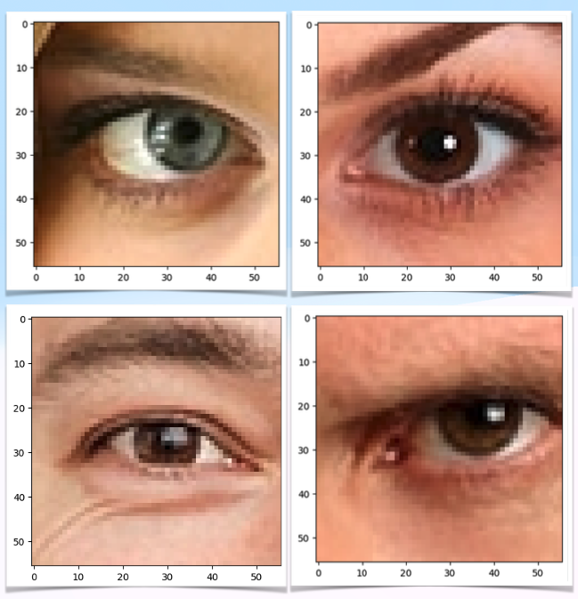
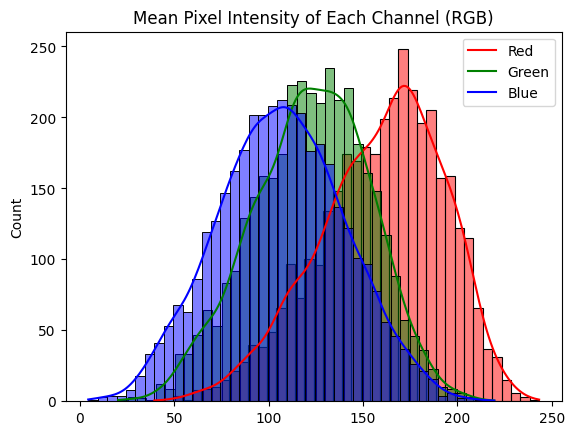
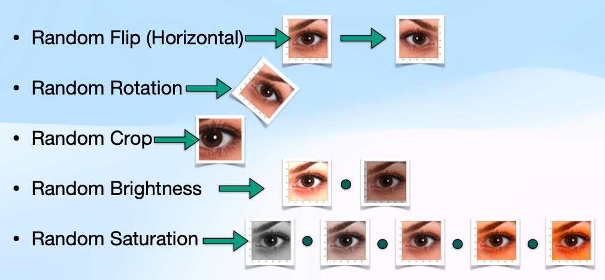
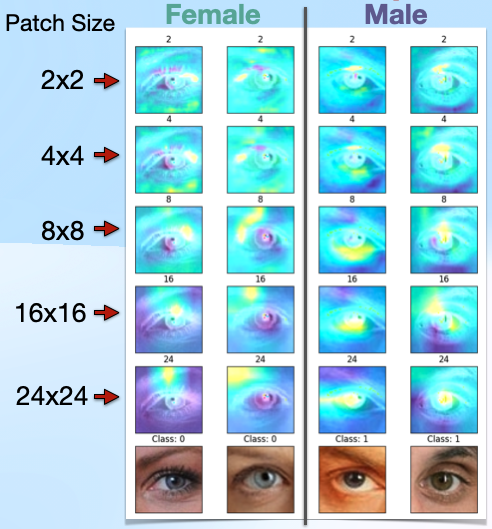
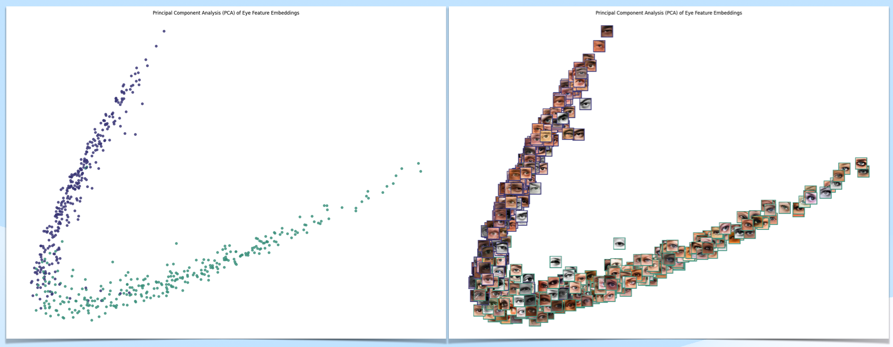
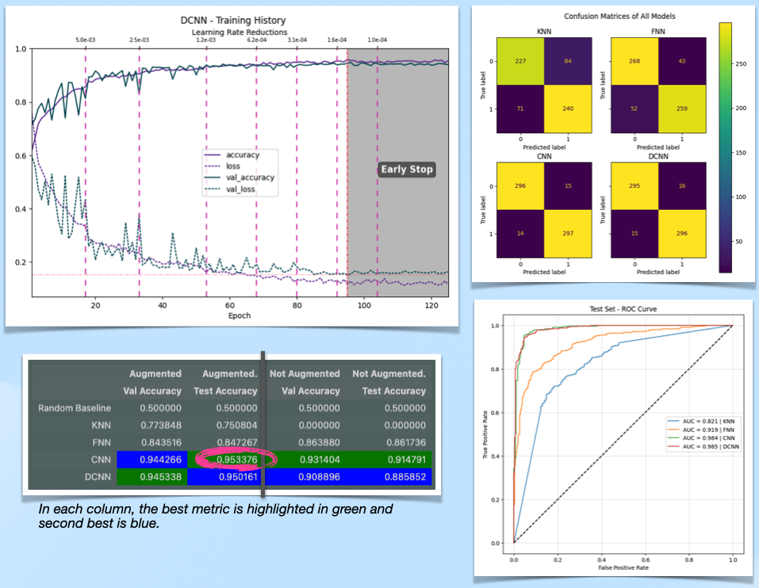

# Periocular Sex Classification Using Deep Learning

This project explores how accurately Deep Convolutional Neural Networks (DCNNs) can classify sex using low-resolution RGB images of the periocular region (the area around the eyes). It compares baseline models and multiple CNN architectures, examines the effect of data augmentation on model performance, and visualizes what features the models are learning. By building classifiers that focus on this subtle but ubiquitous piece of an individual's biometrics, this project addresses the need for more adaptable, hopefully privacy-conscious, and efficient systems in multiple real-world scenarios with limited or non-ideal data.

Repo: [Periocular_Sex_Classification](https://github.com/chill0121/Periocular_Sex_Classification)

*Below is a cursory summary of the project, for more detail please reference the jupyter notebook or download the exported HTML file.*

## Motivation

In scenarios where only partial facial data is available (e.g., security, remote diagnostics), the periocular region may be the most reliable biometric. This work addresses:
- The feasibility of using low-res eye images to determine sex.
- The importance of augmentation in small dataset scenarios.
- Interpretability: what features are these models actually using?

---

## Dataset

- Source: [Kaggle - Eyes RTTE Dataset](https://www.kaggle.com/datasets/pavelbiz/eyes-rtte/data)
- After filtering and balancing: 5,182 images (2591 Male, 2591 Female)
- Final input size: 56×56 RGB pixels



---

## Setup

**Main Tools Used:**
- Python 3.11, NumPy, Pandas, Seaborn, Matplotlib
- scikit-learn (model evaluation, PCA)
- TensorFlow 2.16 (model building, data pipelines)
- tf-explain (occlusion sensitivity)
- Visualkeras (model visualization)

```bash
pip install -r requirements.txt
```

For environment details, see Section 2 of the notebook.

---

## Exploratory Data Analysis

- Pixel intensity distributions suggest generally balanced brightness and RGB tone across the dataset.
- Some skew toward red tones may reflect a lack of demographic diversity.



---

## Data Augmentation

Given the small dataset, extensive augmentation was essential to improve generalization:

- Random horizontal flip
- Rotation (±15°)
- Random cropping
- Brightness/saturation variation



---

## Models

### Baselines
- Random guess: 50%
- K-Nearest Neighbors (KNN): ~77% accuracy on validation

### Deep Learning Models
Trained with and without augmentation:
- Shallow Feedforward Neural Network (FNN)
- Medium CNN
- Deep CNN (DCNN)

---

## Model Interpretability

### Occlusion Sensitivity
Highlights which image regions are most important for classification.




### PCA of Feature Embeddings
Visualized feature space learned by DCNNs — clusters formed clearly by sex.



---

## Results

- DCNN + augmentation gave the highest test accuracy.
- Surprisingly, even shallow models performed well.
- Augmentation significantly improved generalization, especially in deeper models.



---

## Conclusions

- The periocular region contains subtle yet consistent features useful for sex classification.
- Data augmentation is critical in small-image bio-benchmarking tasks.
- There's a nuanced discussion between what’s being learned: sex vs. gender. The project uses “sex” based on dataset labels, but interpretation requires caution.

---

## Future Work

- Expand to include non-binary labels or continuous representation of facial characteristics.
- Explore transfer learning from large facial datasets.
- Apply explainability techniques beyond occlusion (e.g., SHAP, Grad-CAM).

---

## Appendix

Refer to **Appendix A** in the notebook for additional citations and resources.
